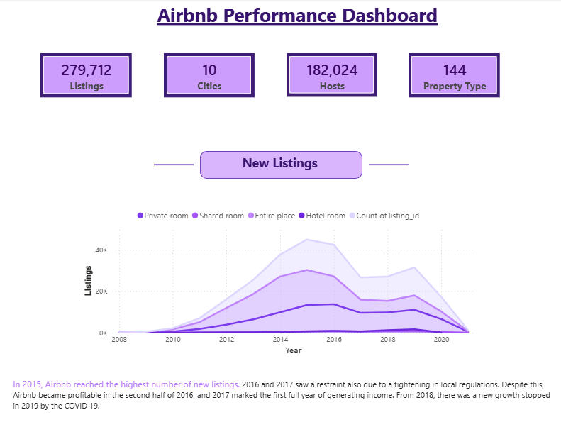
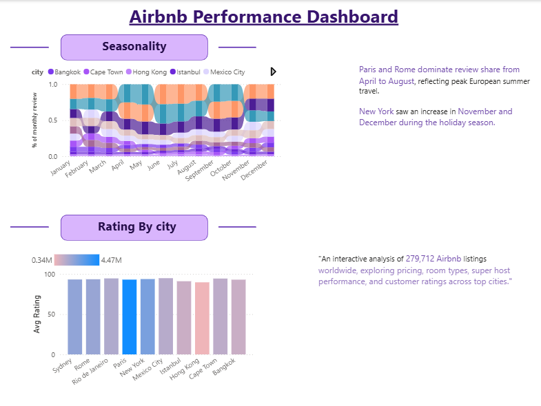

# 🏠 Airbnb Performance Dashboard — Power BI


---

## 📌 Project Overview

An interactive Power BI dashboard analyzing **279,712 Airbnb listings** across **10 global cities**, built using data from [Maven Analytics](https://www.mavenanalytics.io/). The dashboard explores pricing trends, room types, superhost performance, seasonality, and customer ratings.

---

## ✨ Project Highlights

> 🔍 *What makes this dashboard stand out*

| # | Highlight |
|---|-----------|
| 🌍 | **Global Scale** — Covers 10 major cities across 6 continents with 279,712 listings |
| 📅 | **13-Year Trend Analysis** — Tracks Airbnb growth from 2008 to 2021, including COVID-19 impact |
| 🏆 | **Superhost Intelligence** — Visual breakdown of Superhost vs Non-Superhost listing distribution by city |
| 💰 | **Pricing Benchmarking** — Compares Airbnb room types against hotel room prices per city |
| ⭐ | **Multi-Metric Rating System** — Evaluates cities across 5 quality dimensions: Cleanliness, Location, Value, Communication & Accuracy |
| 🌊 | **Seasonality Mapping** — Stream chart reveals monthly demand patterns, exposing peak travel seasons per city |
| 🎯 | **DAX-Powered KPIs** — Custom measures built in DAX for dynamic filtering and accurate aggregations |
| 📊 | **3-Page Interactive Report** — Fully navigable report with slicers for city, room type, and superhost status |

---

## 📸 Dashboard Preview

### 1. Overview


> 📌 KPI cards showing 279,712 listings across 10 cities · New listings trend from 2008–2021 by room type

---

### 2. Market Share by City


> 📌 Superhost vs Non-Superhost listings · Pricing breakdown by room type · Paris leads with most listings & reviews

---

### 3. Ratings & Seasonality


> 📌 City-level rating table · Avg rating bar chart · Monthly seasonality stream chart

---

## 📊 Dashboard Pages

### 1. Overview
- **KPI Cards**: Total Listings (279,712) · Cities (10) · Hosts (182,024) · Property Types (144)
- **New Listings Trend (2008–2021)**: Area chart broken down by room type (Private room, Shared room, Entire place, Hotel room)
- **Key Insight**: Airbnb peaked in new listings in **2015**; growth was halted in **2019 by COVID-19**

### 2. Market Share by City
- **Bar Chart**: Superhost vs. Non-Superhost listings by city
- **Horizontal Bar Chart**: Average pricing by room type (Hotel room, Entire place, Shared room, Private room)
- **Key Insight**: **Paris** leads in total listings and reviews; hotel prices in Paris are ~2× the cost of Airbnb
- **Key Insight**: **Paris, NYC, and Sydney** account for nearly **59% of total reviews**

### 3. Ratings & Seasonality
- **Ratings Table**: City-level breakdown across Cleanliness, Location, Value, Communication, and Accuracy
- **Avg Rating Bar Chart**: Comparative average rating per city
- **Seasonality Stream Chart**: Monthly review share by city across the full year
- **Key Insights**:
  - **Mexico City** and **Rio de Janeiro** are the top-rated cities overall
  - **Hong Kong** and **Istanbul** score lowest
  - **Paris & Rome** dominate April–August (European summer peak)
  - **New York** spikes in November–December (holiday season)

---

## 🗃️ Data Source

| Detail | Info |
|--------|------|
| **Provider** | [Maven Analytics](https://www.mavenanalytics.io/) |
| **Dataset** | Airbnb Listings & Reviews |
| **Cities Covered** | Paris, Rome, New York, Mexico City, Cape Town, Rio de Janeiro, Sydney, Bangkok, Istanbul, Hong Kong |
| **Total Listings** | 279,712 |
| **Total Hosts** | 182,024 |
| **Property Types** | 144 |

---

## 🛠️ Tools & Technologies

| Tool | Purpose |
|------|---------|
| **Power BI Desktop** | Dashboard development & visualization |
| **Power Query (M)** | Data transformation & cleaning |
| **DAX** | Calculated measures & KPIs |
| **Maven Analytics** | Raw dataset source |

---

## 📐 Key DAX Measures

```DAX
-- Total Listings
Total Listings = COUNTROWS(Listings)

-- Superhost %
Superhost Rate = 
DIVIDE(
    CALCULATE(COUNTROWS(Listings), Listings[host_is_superhost] = "t"),
    COUNTROWS(Listings)
)

-- Average Rating
Avg Rating = AVERAGE(Reviews[review_scores_rating])

-- New Listings per Year
New Listings YoY = 
CALCULATE(
    COUNTROWS(Listings),
    USERELATIONSHIP(Listings[host_since], DateTable[Date])
)
```

---

## 📈 Key Insights Summary

- 🏆 **Paris** has the most listings and reviews globally
- 💰 **Hotel rooms** are the most expensive room type across cities
- ⭐ **Mexico City & Rio de Janeiro** lead in overall guest ratings
- 📅 **2015** was the peak year for new Airbnb listings
- 🦠 **COVID-19** caused a sharp drop in listings from 2019 onwards
- 🌞 **European cities** (Paris, Rome) dominate summer travel (April–August)
- 🎄 **New York** peaks in reviews during the holiday season (Nov–Dec)
- 🧹 **Cleanliness** and **Value for Money** are the lowest-scoring metrics globally

---
## 📬 Connect with Me

[](https://www.linkedin.com/in/garvitsingh6)

---

*Data sourced from [Maven Analytics](https://www.mavenanalytics.io/) · Built with Power BI*

## 🗂️ File Structure
